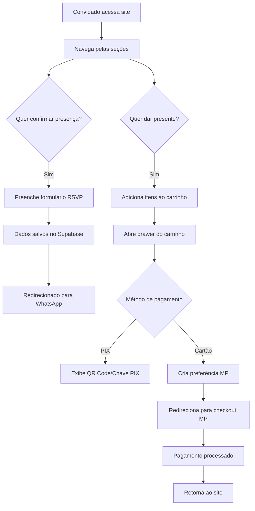
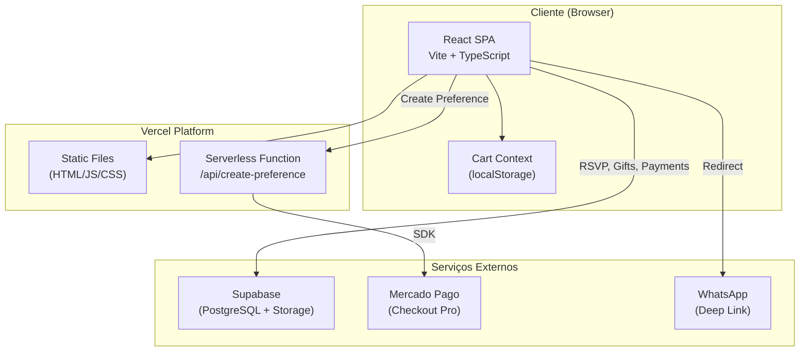

# 📋 DOCUMENTAÇÃO COMPLETA — Template White-Label de Casamento

> **Gerado em:** 06 de Janeiro de 2026 | **Atualizado:** 06 de Janeiro de 2026  
> **Repositório:** Convite-Casamento  
> **Tipo:** Single Page Application (SPA) — Template White-Label de Convite Digital
>
> 🏷️ **Template White-Label:** Este projeto foi refatorado para ser um template reutilizável. Para configurar um novo casamento, edite apenas `src/config/wedding-config.ts`.

---

## 📑 Sumário

1. [Inventário do Projeto](#1-inventário-do-projeto)
   - [Estrutura de Pastas](#11-estrutura-de-pastas)
   - [Entrypoints](#12-entrypoints)
   - [Scripts/Comandos](#13-scriptscomandos)
   - [Dependências Principais](#14-dependências-principais)
   - [Infra/Deploy](#15-infradeploy)
2. [Configuração White-Label](#2-configuração-white-label) ⭐ **NOVO**
   - [Estrutura de Configuração](#21-estrutura-de-configuração)
   - [Como Configurar um Novo Casamento](#22-como-configurar-um-novo-casamento)
   - [Personalização de Tema](#23-personalização-de-tema)
   - [Presets de Temas](#23b-presets-de-temas)
   - [Configuração de Imagens (Assets)](#24-configuração-de-imagens-assets)
   - [SEO Dinâmico](#25-seo-dinâmico)
3. [Visão Geral](#3-visão-geral)
   - [Problema Resolvido](#31-problema-resolvido)
   - [Usuários Principais](#32-usuários-principais)
   - [Escopo e Não-Escopo](#33-escopo-e-não-escopo)
   - [Fluxos Principais](#34-fluxos-principais)
4. [Stacks e Tecnologias](#4-stacks-e-tecnologias)
5. [Arquitetura](#5-arquitetura)
   - [Diagrama de Alto Nível](#51-diagrama-de-alto-nível)
   - [Estrutura de Pastas Explicada](#52-estrutura-de-pastas-explicada)
   - [Camadas e Responsabilidades](#53-camadas-e-responsabilidades)
   - [Decisões Arquiteturais](#54-decisões-arquiteturais-inferido)
6. [Setup do Ambiente](#6-setup-do-ambiente)
   - [Requisitos](#61-requisitos)
   - [Instalação](#62-instalação)
   - [Variáveis de Ambiente](#63-variáveis-de-ambiente)
   - [Executando Localmente](#64-executando-localmente)
   - [Docker](#65-docker)
7. [Execução e Operação](#7-execução-e-operação)
8. [API e Integrações](#8-api-e-integrações)
   - [Serverless API (Vercel)](#81-serverless-api-vercel)
   - [Supabase](#82-supabase)
   - [Mercado Pago](#83-mercado-pago)
   - [WhatsApp](#84-whatsapp)
9. [Dados](#9-dados)
   - [Modelo de Dados](#91-modelo-de-dados)
   - [Migrações e Seed](#92-migrações-e-seed)
10. [Testes e Qualidade](#10-testes-e-qualidade)
11. [CI/CD e Deploy](#11-cicd-e-deploy)
12. [Observabilidade e Troubleshooting](#12-observabilidade-e-troubleshooting)
13. [Segurança](#13-segurança)
14. [Contribuição](#14-contribuição)
15. [Pendências / Não Encontrado no Repositório](#15-pendências--não-encontrado-no-repositório)

---

## 1. Inventário do Projeto

### 1.1 Estrutura de Pastas

```
Convite-Casamento/
├── api/                          # Serverless functions (Vercel)
│   └── create-preference.js      # Mercado Pago payment endpoint
├── public/                       # Arquivos estáticos
│   ├── casamento/                # 🖼️ IMAGENS WHITE-LABEL
│   │   ├── galeria/              # Fotos do casal (foto-01.jpg a foto-09.jpg)
│   │   ├── backgrounds/          # Fundos das seções (hero-bg.jpg, story.jpg, etc.)
│   │   └── venue/                # Imagens do local (buffet.jpg, location.jpg)
│   ├── favicon.ico
│   ├── favicon.png
│   ├── images/                   # Outras imagens do site
│   └── robots.txt
├── src/                          # Código-fonte principal
│   ├── assets/                   # Assets bundlados
│   ├── components/               # Componentes React (64 arquivos)
│   │   ├── ui/                   # shadcn/ui components (52 arquivos)
│   │   ├── AdminDashboard.tsx
│   │   ├── CartDrawer.tsx
│   │   ├── CeremonySection.tsx
│   │   ├── Footer.tsx
│   │   ├── GallerySection.tsx
│   │   ├── GiftListPage.tsx
│   │   ├── GiftsSection.tsx
│   │   ├── HeroSection.tsx
│   │   ├── MenuSection.tsx
│   │   ├── Navigation.tsx
│   │   ├── OurStorySection.tsx
│   │   └── RSVPSection.tsx
│   ├── config/                   # ⭐ CONFIGURAÇÃO WHITE-LABEL
│   │   ├── index.ts              # Barrel export
│   │   ├── themes.ts             # 🎨 PRESETS DE TEMAS
│   │   └── wedding-config.ts     # 🎯 ARQUIVO PRINCIPAL DE CONFIG
│   ├── constants/
│   │   └── initialGifts.ts       # Lista inicial de presentes (72 itens)
│   ├── contexts/
│   │   └── CartContext.tsx       # Contexto do carrinho de compras
│   ├── hooks/
│   │   ├── use-mobile.tsx
│   │   ├── use-toast.ts
│   │   └── useCountdown.ts
│   ├── lib/
│   │   └── utils.ts              # Utilitários (cn, etc.)
│   ├── pages/
│   │   ├── Index.tsx             # Página principal
│   │   └── NotFound.tsx          # Página 404
│   ├── services/
│   │   ├── giftService.ts        # CRUD de presentes e pagamentos
│   │   ├── paymentService.ts     # Integração Mercado Pago
│   │   ├── rsvpService.ts        # Confirmação de presença
│   │   ├── supabase.ts           # Cliente Supabase
│   │   └── index.ts
│   ├── App.tsx                   # Componente raiz com rotas + ThemeProvider
│   ├── constants.ts              # Re-exports de config + utilitários
│   ├── types.ts                  # Definições TypeScript
│   ├── main.tsx                  # Entry point React
│   ├── index.css                 # Estilos globais + CSS Variables
│   └── mobile.css                # Estilos mobile específicos
├── .env.example                  # Template de variáveis de ambiente
├── .gitignore
├── components.json               # Configuração shadcn/ui
├── database_schema.sql           # 🗄️ SCHEMA SQL PARA NOVOS CLIENTES
├── DOCUMENTACAO.md               # Esta documentação
├── eslint.config.js              # Configuração ESLint
├── index.html                    # HTML template
├── package.json                  # Dependências e scripts
├── postcss.config.js             # Configuração PostCSS
├── SETUP_GUIDE.md                # 🚀 GUIA DE SETUP PARA NOVOS CLIENTES
├── tailwind.config.ts            # Configuração Tailwind CSS
├── tsconfig.json                 # Configuração TypeScript
├── vercel.json                   # Configuração Vercel
└── vite.config.ts                # Configuração Vite
```

### 1.2 Entrypoints

| Arquivo | Descrição |
|---------|-----------|
| `index.html` | HTML template que monta a SPA |
| `src/main.tsx` | Bootstrap do React, renderiza `<App />` |
| `src/App.tsx` | Componente raiz com providers e rotas |
| `api/create-preference.js` | Serverless function para Mercado Pago |
| `database_schema.sql` | **Script SQL** para criar tabelas no Supabase |
| `SETUP_GUIDE.md` | **Guia de setup** para novos clientes |

### 1.3 Scripts/Comandos

**Origem:** `package.json`

| Comando | Descrição |
|---------|-----------|
| `npm run dev` | Inicia servidor de desenvolvimento (porta 8080) |
| `npm run build` | Build de produção |
| `npm run build:dev` | Build em modo desenvolvimento |
| `npm run lint` | Executa ESLint |
| `npm run preview` | Preview do build de produção |

### 1.4 Dependências Principais

**Origem:** `package.json`

#### Runtime

| Pacote | Versão | Uso |
|--------|--------|-----|
| `react` | ^18.3.1 | Framework UI |
| `react-dom` | ^18.3.1 | Renderização DOM |
| `react-router-dom` | ^6.30.1 | Roteamento SPA |
| `@supabase/supabase-js` | ^2.89.0 | Cliente Supabase (BaaS) |
| `mercadopago` | ^2.11.0 | SDK Mercado Pago |
| `@tanstack/react-query` | ^5.83.0 | Data fetching/caching |
| `framer-motion` | ^12.23.26 | Animações |
| `tailwind-merge` | ^2.6.0 | Merge de classes Tailwind |
| `zod` | ^3.25.76 | Validação de schemas |
| `react-hook-form` | ^7.61.1 | Formulários |
| `date-fns` | ^3.6.0 | Manipulação de datas |
| `lucide-react` | ^0.462.0 | Ícones |
| `sonner` | ^1.7.4 | Notificações toast |
| `vaul` | ^0.9.9 | Drawers/modais mobile |

#### shadcn/ui (Radix UI)

- 25+ componentes Radix UI (`@radix-ui/react-*`)
- `class-variance-authority` ^0.7.1
- `tailwindcss-animate` ^1.0.7

#### DevDependencies

| Pacote | Versão | Uso |
|--------|--------|-----|
| `vite` | ^5.4.19 | Bundler/Dev server |
| `@vitejs/plugin-react-swc` | ^3.11.0 | Plugin React com SWC |
| `typescript` | ^5.8.3 | Linguagem |
| `tailwindcss` | ^3.4.17 | CSS framework |
| `eslint` | ^9.32.0 | Linter |
| `postcss` | ^8.5.6 | Processador CSS |
| `autoprefixer` | ^10.4.21 | Prefixos CSS |

### 1.5 Infra/Deploy

| Item | Tecnologia | Evidência |
|------|------------|-----------|
| Hosting | Vercel | `vercel.json`, `.vercel/` |
| Serverless Functions | Vercel Functions | `api/create-preference.js` |
| Database/Auth | Supabase | `src/services/supabase.ts` |
| Pagamentos | Mercado Pago | `api/create-preference.js` |

---

## 2. Configuração White-Label ⭐

> **Este projeto é um template reutilizável.** Para configurar um novo casamento, você só precisa editar um arquivo.

### 2.1 Estrutura de Configuração

| Arquivo | Descrição |
|---------|----------|
| `src/config/wedding-config.ts` | **🎯 Arquivo principal** - Toda configuração do casamento |
| `src/config/index.ts` | Barrel export para facilitar importações |
| `src/constants.ts` | Re-exports + utilitários (não editar) |

### 2.2 Como Configurar um Novo Casamento

Edite `src/config/wedding-config.ts`:

```typescript
// INFORMAÇÕES DO CASAL
export const COUPLE = {
  groom: "Novo Nome",
  bride: "Nova Noiva",
  displayName: "Novo & Nova",
  initials: "N & N",
  story: {
    paragraph1: "Sua história aqui...",
    paragraph2: "Continuação da história..."
  }
};

// DATA E LOCAL
export const WEDDING = {
  date: new Date("2027-01-15T18:00:00"),
  dateFormatted: "15 de Janeiro de 2027",
  time: "18:00",
  confirmationDeadline: "01/01/2027"
};

export const VENUE = {
  name: "Nome do Local",
  address: "Endereço Completo",
  mapsUrl: "https://maps.google.com/...",
  wazeUrl: "https://waze.com/ul?..."
};

// CONTATO E PAGAMENTO
export const CONTACT = {
  whatsappNumber: "5500000000000",
  whatsappUrl: (msg: string) => `https://wa.me/5500000000000?text=${msg}`
};

export const PIX = {
  key: "chave-pix",
  keyType: "Celular",
  recipientName: "Nome do Destinatário",
  bank: "Nome do Banco"
};
```

### 2.3 Personalização de Tema

As cores são configuradas no objeto `THEME`:

```typescript
export const THEME = {
  fonts: {
    script: '"Great Vibes", cursive',      // Nomes do casal
    heading: '"Playfair Display", serif',  // Títulos
    body: '"Cormorant Garamond", serif'    // Corpo
  },
  colors: {
    primary: "15 95% 31%",      // HSL - Cor principal
    secondary: "37 30% 52%",    // HSL - Cor secundária
    background: "43 100% 97%",  // HSL - Fundo
    // ... mais cores
  }
};
```

> **ℹ️ Nota:** As cores são injetadas como CSS Variables automaticamente pelo `ThemeProvider` em `App.tsx`.

### 2.3b Presets de Temas

> **🎨 Troque o visual do site inteiro mudando uma string!**

O arquivo `src/config/themes.ts` contém 3 presets de cores prontos:

| Preset | Descrição | Cores Principais |
|--------|-----------|------------------|
| `CLASSIC_GOLD` | Elegante dourado e creme | Marrom, Dourado, Creme |
| `NIGHT_BLUE` | Sofisticado azul royal | Azul Royal, Prata, Branco |
| `RUSTIC_EARTH` | Rústico e natural | Terracota, Verde Oliva, Bege |

#### Como Trocar o Tema

Edite `src/config/wedding-config.ts`:

```typescript
// Mude esta linha para trocar o tema
export const ACTIVE_THEME: ThemePresetName = "CLASSIC_GOLD";

// Opções disponíveis:
// - "CLASSIC_GOLD"  (atual)
// - "NIGHT_BLUE"
// - "RUSTIC_EARTH"
```

#### Criar Novo Preset

Adicione um novo preset em `src/config/themes.ts`:

```typescript
export const THEME_PRESETS = {
  // ... presets existentes ...
  
  MEU_TEMA: {
    name: "Meu Tema",
    description: "Descrição do tema",
    colors: {
      background: "0 0% 100%",    // HSL
      primary: "220 70% 50%",
      // ... todas as cores
    }
  }
};
```

### 2.4 Configuração de Imagens (Assets)

> **🖼️ Para novos clientes:** Substitua os arquivos em `public/casamento/` mantendo os mesmos nomes.

#### Estrutura de Pastas

```
public/casamento/
├── galeria/
│   ├── foto-01.jpg      → Foto do casal 1
│   ├── foto-02.jpg      → Foto do casal 2
│   ├── ...              → (até foto-09.jpg)
│   └── foto-09.jpg      → Foto do casal 9
├── backgrounds/
│   ├── hero-bg.jpg      → Imagem principal do Hero
│   ├── story.jpg        → Seção "Nossa História"
│   ├── ceremony.jpg     → Seção "Cerimônia"
│   ├── gifts.jpg        → Seção "Presentes"
│   └── pattern.png      → Padrão decorativo de fundo
└── venue/
    ├── buffet.jpg       → Imagem do buffet
    └── location.jpg     → Imagem do local
```

#### Configuração no Código

Os caminhos são definidos em `src/config/wedding-config.ts`:

```typescript
export const ASSETS = {
  backgrounds: {
    hero: "/casamento/backgrounds/hero-bg.jpg",
    story: "/casamento/backgrounds/story.jpg",
    ceremony: "/casamento/backgrounds/ceremony.jpg",
    gifts: "/casamento/backgrounds/gifts.jpg",
    pattern: "/casamento/backgrounds/pattern.png",
  },
  venue: {
    buffet: "/casamento/venue/buffet.jpg",
    location: "/casamento/venue/location.jpg",
  },
  gallery: [
    { src: "/casamento/galeria/foto-01.jpg", alt: "Foto do casal 1" },
    { src: "/casamento/galeria/foto-02.jpg", alt: "Foto do casal 2" },
    // ... até foto-09
  ],
};
```

#### Componentes que Usam ASSETS

| Componente | Asset Usado |
|------------|-------------|
| `HeroSection.tsx` | `ASSETS.backgrounds.hero` |
| `OurStorySection.tsx` | `ASSETS.backgrounds.story` |
| `CeremonySection.tsx` | `ASSETS.backgrounds.ceremony`, `ASSETS.venue.location` |
| `GiftsSection.tsx` | `ASSETS.backgrounds.gifts` |
| `GallerySection.tsx` | `ASSETS.gallery` (array) |
| `BackgroundPattern.tsx` | `ASSETS.backgrounds.pattern` |
| `MenuSection.tsx` | `ASSETS.venue.buffet` |

### 2.5 SEO Dinâmico

O componente `SEOManager.tsx` atualiza automaticamente os meta tags baseado na configuração.

#### Funcionalidades

- **Título da página:** `{Noivo} & {Noiva} - Casamento`
- **Meta description:** Texto gerado automaticamente com nome e data
- **Open Graph:** Título, descrição e imagem hero para WhatsApp/Facebook
- **Twitter Card:** Suporte a cards grandes

#### Como Funciona

```typescript
// SEOManager.tsx - Executado no App.tsx
document.title = `${COUPLE.displayName} - Casamento`;
updateMetaTag("og:image", ASSETS.backgrounds.hero);
// ... outras meta tags
```

> **📱 WhatsApp:** A imagem do hero é automaticamente usada quando o link é compartilhado!

---

## 3. Visão Geral

### 3.1 Problema Resolvido

Este projeto é um **site de convite digital para casamento** que permite aos noivos Eduardo e Nicole:
- Apresentar informações sobre o casamento (data, local, cardápio)
- Receber confirmações de presença (RSVP) dos convidados
- Oferecer uma lista de presentes virtual com pagamento via PIX ou cartão de crédito
- Gerenciar convidados e presentes através de um painel administrativo

### 3.2 Usuários Principais

1. **Convidados** — Visualizam o convite, confirmam presença, escolhem e pagam presentes
2. **Noivos (Administradores)** — Gerenciam lista de presentes, visualizam confirmações e pagamentos

### 3.3 Escopo e Não-Escopo

**Escopo:**
- Landing page com seções: Hero, Nossa História, Galeria, Cerimônia, Cardápio, Presentes, RSVP
- Sistema de carrinho de presentes com persistência local
- Pagamento via PIX (manual) e cartão de crédito (Mercado Pago)
- Confirmação de presença com integração WhatsApp
- Painel administrativo para gerenciar dados
- Página separada para lista completa de presentes (`/lista-presentes`)

**Não-Escopo:**
- Autenticação de convidados (acesso público)
- Envio automático de e-mails/SMS
- Múltiplos idiomas

### 3.4 Fluxos Principais



---

## 4. Stacks e Tecnologias

| Categoria | Tecnologia | Versão | Evidência |
|-----------|------------|--------|-----------|
| **Linguagem** | TypeScript | ^5.8.3 | `package.json` (devDependencies) |
| **Runtime** | Node.js | ≥18 (inferido) | `package.json` (ESM modules) |
| **Framework Frontend** | React | ^18.3.1 | `package.json` |
| **Bundler** | Vite | ^5.4.19 | `vite.config.ts` |
| **CSS Framework** | Tailwind CSS | ^3.4.17 | `tailwind.config.ts` |
| **Componentes UI** | shadcn/ui + Radix UI | Múltiplos | `components.json`, `src/components/ui/` |
| **Roteamento** | React Router DOM | ^6.30.1 | `src/App.tsx` |
| **Estado/Cache** | TanStack Query | ^5.83.0 | `src/App.tsx` |
| **Formulários** | React Hook Form + Zod | ^7.61.1 / ^3.25.76 | `package.json` |
| **Animações** | Framer Motion | ^12.23.26 | Componentes diversos |
| **Backend (BaaS)** | Supabase | ^2.89.0 | `src/services/supabase.ts` |
| **Pagamentos** | Mercado Pago SDK | ^2.11.0 | `api/create-preference.js` |
| **Serverless** | Vercel Functions | — | `api/`, `vercel.json` |
| **Hosting** | Vercel | — | `vercel.json`, `.vercel/` |
| **Linter** | ESLint | ^9.32.0 | `eslint.config.js` |
| **Tipografia** | Google Fonts | — | `tailwind.config.ts` (Great Vibes, Playfair Display, Cormorant Garamond) |

---

## 5. Arquitetura

### 5.1 Diagrama de Alto Nível



### 5.2 Estrutura de Pastas Explicada

| Pasta/Arquivo | Responsabilidade |
|---------------|------------------|
| `api/` | Vercel Serverless Functions (backend) |
| `public/` | Assets estáticos servidos diretamente |
| `src/components/` | Componentes React (sections do site + UI) |
| `src/components/ui/` | Componentes shadcn/ui reutilizáveis |
| `src/config/` | **🎯 Configuração White-Label** (editar para novo casamento) |
| `src/constants/` | Dados estáticos (lista inicial de presentes) |
| `src/contexts/` | React Contexts (carrinho de compras) |
| `src/hooks/` | Custom hooks (countdown, toast, mobile) |
| `src/lib/` | Utilitários (cn para classes) |
| `src/pages/` | Páginas/rotas da aplicação |
| `src/services/` | Camada de serviços (API calls) |
| `src/types.ts` | Definições TypeScript compartilhadas |
| `src/constants.ts` | Re-exports de config + utilitários |

### 5.3 Camadas e Responsabilidades

1. **Apresentação** (`components/`, `pages/`)
   - Renderização da UI
   - Interação com usuário
   - Navegação entre seções

2. **Estado** (`contexts/`, `hooks/`)
   - Carrinho de compras (CartContext)
   - Countdown até o casamento
   - Detecção de dispositivo mobile

3. **Serviços** (`services/`)
   - `supabase.ts` — Cliente e configuração Supabase
   - `giftService.ts` — CRUD de presentes e pagamentos
   - `rsvpService.ts` — Confirmações de presença
   - `paymentService.ts` — Integração com API de pagamento

4. **Backend** (`api/`)
   - `create-preference.js` — Cria preferência de pagamento no Mercado Pago

### 5.4 Decisões Arquiteturais (Inferido)

| Decisão | Justificativa |
|---------|---------------|
| **SPA com React** | Experiência fluida sem recarregamentos |
| **Supabase como BaaS** | Reduz complexidade de backend (DB + Storage + Auth gratuitos) |
| **Serverless para Mercado Pago** | Token de acesso não exposto no cliente |
| **Carrinho no localStorage** | Persistência sem necessidade de autenticação |
| **shadcn/ui** | Componentes acessíveis e altamente customizáveis |
| **Tailwind CSS** | Estilização rápida e consistente |
| **Framer Motion** | Animações premium para experiência de convite |

---

## 6. Setup do Ambiente

### 6.1 Requisitos

| Requisito | Versão Mínima | Verificar com |
|-----------|---------------|---------------|
| Node.js | 18.x | `node -v` |
| npm | 9.x | `npm -v` |
| Conta Supabase | — | https://supabase.com |
| Conta Mercado Pago | — | https://mercadopago.com.br |
| Conta Vercel | — | https://vercel.com |

### 6.2 Instalação

```bash
# 1. Clonar repositório
git clone https://github.com/CodTeteu/casamento-dudu-nicole.git

# 2. Entrar no diretório
cd Convite-Casamento

# 3. Instalar dependências
npm install

# 4. Copiar arquivo de ambiente
cp .env.example .env

# 5. Configurar variáveis de ambiente (ver seção 5.3)

# 6. Iniciar servidor de desenvolvimento
npm run dev
```

### 6.3 Variáveis de Ambiente

**Origem:** `.env.example`

| Variável | Descrição | Exemplo | Obrigatório | Onde Usado |
|----------|-----------|---------|-------------|------------|
| `VITE_SUPABASE_URL` | URL do projeto Supabase | `https://xxx.supabase.co` | ✅ Sim | `src/services/supabase.ts` |
| `VITE_SUPABASE_ANON_KEY` | Chave anônima Supabase | `eyJhbGciOiJIUzI1...` | ✅ Sim | `src/services/supabase.ts` |
| `VITE_PIX_KEY` | Chave PIX para pagamentos | `51985363626` | Não | `src/types.ts`, `src/constants.ts` |
| `VITE_PIX_NAME` | Nome do destinatário PIX | `Eduardo Piccini Martins` | Não | `src/types.ts` |
| `VITE_PIX_BANK` | Banco do PIX | `Mercado Pago` | Não | `src/constants.ts` |
| `VITE_CONFIRMATION_PHONE` | WhatsApp para confirmações | `5551996662954` | Não | `src/types.ts` |
| `MERCADO_PAGO_ACCESS_TOKEN` | Token de produção MP (Vercel) | `APP_USR-xxx...` | ✅ Sim (prod) | `api/create-preference.js` |

> **⚠️ Importante:** A variável `MERCADO_PAGO_ACCESS_TOKEN` deve ser configurada **apenas no Vercel** (Environment Variables), nunca no arquivo `.env` local exposto.

### 6.4 Executando Localmente

```bash
# Desenvolvimento (hot reload)
npm run dev
# Acesse: http://localhost:8080

# Build de produção
npm run build

# Preview do build
npm run preview

# Lint
npm run lint
```

### 6.5 Docker

> **Não encontrado no repositório.** O projeto não possui configuração Docker (`Dockerfile` ou `docker-compose.yml`). O deploy é feito diretamente via Vercel.

---

## 7. Execução e Operação

### Portas e URLs

| Ambiente | URL | Porta |
|----------|-----|-------|
| Desenvolvimento | `http://localhost:8080` | 8080 |
| Produção | `https://eduardo-nicole.vercel.app` | 443 |

### Rotas da Aplicação

**Origem:** `src/App.tsx`

| Rota | Componente | Descrição |
|------|------------|-----------|
| `/` | `Index` | Página principal com todas as seções |
| `/admin` | `AdminDashboard` (lazy) | Painel administrativo |
| `/lista-presentes` | `GiftListPage` | Lista completa de presentes |
| `*` | `NotFound` | Página 404 |

### Health Checks

> **Não encontrado no repositório.** Não há endpoint de health check dedicado. O site pode ser verificado acessando a URL principal.

### Jobs/Cron

> **Não encontrado no repositório.** Não há jobs agendados configurados.

### Configurações por Ambiente

O projeto usa variáveis de ambiente com prefixo `VITE_` para distinguir desenvolvimento de produção. As variáveis sensíveis (como `MERCADO_PAGO_ACCESS_TOKEN`) são configuradas diretamente no painel do Vercel.

---

## 8. API e Integrações

### 8.1 Serverless API (Vercel)

#### `POST /api/create-preference`

**Origem:** `api/create-preference.js`

Cria uma preferência de pagamento no Mercado Pago.

**Request:**
```json
{
  "items": [
    {
      "id": "gift-1",
      "name": "Jogo de Panelas",
      "description": "Presente de casamento",
      "price": 250.00,
      "quantity": 1,
      "imageUrl": "https://..."
    }
  ],
  "buyerName": "João Silva",
  "buyerPhone": "5551999999999",
  "buyerEmail": "joao@email.com",
  "successUrl": "https://eduardo-nicole.vercel.app"
}
```

**Response (200):**
```json
{
  "init_point": "https://www.mercadopago.com.br/checkout/v1/redirect?pref_id=xxx",
  "sandbox_init_point": "https://sandbox.mercadopago.com.br/checkout/v1/redirect?pref_id=xxx",
  "id": "xxx"
}
```

**Response (500):**
```json
{
  "error": "Mensagem de erro"
}
```

**Métodos de pagamento excluídos:**
- `bank_transfer` (PIX/transferência)
- `ticket` (boleto)
- `atm` (caixa eletrônico)
- `debit_card` (cartão de débito)

### 8.2 Supabase

**Origem:** `src/services/supabase.ts`

O cliente Supabase é inicializado a partir das variáveis de ambiente. Se não configurado, o sistema opera em "modo offline" usando dados locais.

```typescript
// Verificação de configuração
export const isSupabaseConfigured = Boolean(supabaseUrl && supabaseAnonKey);
```

#### Tabelas Utilizadas

| Tabela | Serviço | Operações |
|--------|---------|-----------|
| `gifts` | `giftService.ts` | SELECT, INSERT, UPDATE, DELETE |
| `gift_payments` | `giftService.ts` | SELECT, INSERT, UPDATE, DELETE |
| `rsvp_responses` | `rsvpService.ts` | SELECT, INSERT, DELETE |

#### Storage Bucket

| Bucket | Uso |
|--------|-----|
| `gifts` | Imagens dos presentes |

### 8.3 Mercado Pago

**Origem:** `src/services/paymentService.ts`, `api/create-preference.js`

| Configuração | Valor | Origem |
|--------------|-------|--------|
| Checkout | Checkout Pro | `api/create-preference.js` |
| Taxa | 4.99% (cartão) | `src/constants.ts` |
| Moeda | BRL | `api/create-preference.js` |

**Função de cálculo de taxa:**
```typescript
// src/constants.ts
export const MERCADO_PAGO_FEE_RATE = 0.0499;

export const calculateMPAdjustedPrice = (originalPrice: number): number => {
    const adjustedPrice = originalPrice / (1 - MERCADO_PAGO_FEE_RATE);
    return Math.round(adjustedPrice * 100) / 100;
};
```

### 8.4 WhatsApp

**Origem:** `src/constants.ts`

Após confirmação de presença, o usuário é redirecionado para o WhatsApp com mensagem pré-preenchida:

```typescript
export const CONTACT = {
    whatsappNumber: "5551996662954",
    whatsappUrl: (message: string) => `https://wa.me/5551996662954?text=${message}`,
};
```

---

## 9. Dados

### 9.1 Modelo de Dados

#### Tabela `gifts`

| Campo | Tipo | Descrição |
|-------|------|-----------|
| `id` | uuid | Primary key |
| `name` | text | Nome do presente |
| `price` | decimal | Preço |
| `description` | text | Descrição |
| `image_url` | text | URL da imagem |
| `category` | text | Categoria (Cozinha, Eletro, etc.) |
| `featured` | boolean | Destaque na lista |
| `created_at` | timestamp | Data de criação |

#### Tabela `gift_payments`

| Campo | Tipo | Descrição |
|-------|------|-----------|
| `id` | uuid | Primary key |
| `buyer_name` | text | Nome do comprador |
| `buyer_email` | text | Email (gerado a partir do telefone) |
| `buyer_phone` | text | Telefone |
| `items` | jsonb | Array de itens comprados |
| `total_amount` | decimal | Valor total |
| `payment_method` | text | 'pix' ou 'mercadopago' |
| `status` | text | 'pending', 'pending_confirmation', 'approved', 'rejected' |
| `message` | text | Mensagem opcional |
| `created_at` | timestamp | Data de criação |

#### Tabela `rsvp_responses`

| Campo | Tipo | Descrição |
|-------|------|-----------|
| `id` | uuid | Primary key |
| `full_name` | text | Nome completo |
| `phone` | text | Telefone |
| `is_attending` | boolean | Confirmou presença |
| `total_guests` | integer | Total de convidados |
| `companions` | jsonb | Array de acompanhantes |
| `payment_method` | text | Método de pagamento |
| `total_cost` | decimal | Custo total |
| `song_request` | text | Sugestão de música |
| `message` | text | Mensagem |
| `status` | text | Status da confirmação |
| `created_at` | timestamp | Data de criação |

### 9.2 Migrações e Seed

#### Schema SQL

**Origem:** `database_schema.sql`

O arquivo `database_schema.sql` na raiz contém o script completo para criar as tabelas no Supabase:

```sql
-- Tabelas criadas:
CREATE TABLE gifts (...);
CREATE TABLE gift_payments (...);
CREATE TABLE rsvp_responses (...);

-- Inclui também:
-- - Índices para performance
-- - Políticas RLS (Row Level Security)
-- - Comentários explicativos
```

> 📝 **Para novos clientes:** Execute o script `database_schema.sql` no SQL Editor do Supabase.

#### Seed de Presentes

O arquivo `src/constants/initialGifts.ts` contém **72 presentes** pré-definidos que são usados como fallback quando o Supabase não está configurado ou está vazio.

**Categorias de presentes:**
- Cozinha (29 itens)
- Eletro (6 itens)
- Banheiro (6 itens)
- Utensílios (4 itens)
- Lua de Mel (7 itens)
- Sala (5 itens)
- Quarto (8 itens)
- Lavanderia (7 itens)

**Seed via Admin Dashboard:**
1. Acesse `/admin` e faça login
2. Vá na aba "Gerenciar Lista"
3. Clique em "Importar Lista Inicial"

---

## 10. Testes e Qualidade

### Testes Automatizados

> **Não encontrado no repositório.** Não há configuração de testes (Jest, Vitest, Cypress, etc.).

### Linting

**Origem:** `eslint.config.js`

```bash
npm run lint
```

**Configuração:**
- ESLint 9.x com TypeScript
- Plugins: `react-hooks`, `react-refresh`
- Regra desabilitada: `@typescript-eslint/no-unused-vars`

### Formatação

> **Não encontrado no repositório.** Não há Prettier ou EditorConfig configurados.

### Padrões de Commit

> **Não encontrado no repositório.** Não há Husky, lint-staged ou Conventional Commits configurados.

---

## 11. CI/CD e Deploy

### Plataforma de Deploy

**Vercel** (detectado via `vercel.json` e `.vercel/`)

### Configuração Vercel

**Origem:** `vercel.json`

```json
{
    "rewrites": [
        {
            "source": "/api/(.*)",
            "destination": "/api/$1"
        },
        {
            "source": "/((?!api/).*)",
            "destination": "/index.html"
        }
    ]
}
```

**Explicação:**
- Rotas `/api/*` são direcionadas para serverless functions
- Todas as outras rotas servem `index.html` (SPA fallback)

### Deploy Automático

O deploy é feito automaticamente pelo Vercel ao fazer push para o repositório Git conectado.

**URL de Produção:** `https://eduardo-nicole.vercel.app`

### CI/CD Pipelines

> **Não encontrado no repositório.** Não há GitHub Actions, GitLab CI ou outros pipelines configurados.

### Rollback

Rollbacks podem ser feitos diretamente no painel do Vercel, revertendo para deploys anteriores.

---

## 12. Observabilidade e Troubleshooting

### Logs

| Tipo | Onde Ver |
|------|----------|
| Console do browser | DevTools (F12) |
| Logs Vercel Functions | Vercel Dashboard → Logs |
| Logs Supabase | Supabase Dashboard → Logs |

### Métricas e Alertas

> **Não encontrado no repositório.** Não há configuração de APM/observabilidade (Sentry, DataDog, etc.).

### Erros Comuns

| Erro | Causa | Solução |
|------|-------|---------|
| `Supabase not configured` | Variáveis `VITE_SUPABASE_*` não definidas | Configurar `.env` |
| `MERCADO_PAGO_ACCESS_TOKEN não configurado` | Token não definido no Vercel | Adicionar variável no Vercel |
| Carrinho não persiste | localStorage bloqueado | Verificar configurações do browser |
| CORS error na API | Origem não permitida | Verificar headers em `create-preference.js` |

### Checklist de Diagnóstico

1. [ ] Variáveis de ambiente estão configuradas corretamente?
2. [ ] Supabase está acessível e com tabelas criadas?
3. [ ] Token do Mercado Pago é de produção (não sandbox)?
4. [ ] Console do browser mostra erros JavaScript?
5. [ ] Logs do Vercel mostram erros nas functions?

---

## 13. Segurança

### Autenticação

- **Acesso público:** O site é público para todos os convidados
- **Painel admin:** Acessivel via `/admin` com **autenticação Supabase Auth**

#### Login no Admin Dashboard

O `AdminDashboard.tsx` utiliza Supabase Auth para autenticação:

```typescript
// Verifica sessão inicial
supabase.auth.getSession().then(({ data: { session } }) => {
    setCurrentUser(session?.user ?? null);
});

// Escuta mudanças de autenticação
supabase.auth.onAuthStateChange((_event, session) => {
    setCurrentUser(session?.user ?? null);
});
```

#### Criar Usuário Admin

1. Acesse o painel do Supabase
2. Vá em **Authentication** → **Users**
3. Clique em **Add user** → **Create new user**
4. Preencha email e senha
5. Marque **Auto Confirm User**

> 📝 Consulte `SETUP_GUIDE.md` para instruções detalhadas.

### Armazenamento de Secrets

| Secret | Onde Armazenar |
|--------|----------------|
| `VITE_SUPABASE_ANON_KEY` | `.env` (exposto no client — apenas leitura) |
| `MERCADO_PAGO_ACCESS_TOKEN` | Vercel Environment Variables (nunca no client) |

### Row Level Security (RLS)

O código indica que RLS está habilitado no Supabase:

```typescript
// Don't use .select() - RLS blocks SELECT for anonymous users
const { error } = await supabase.from('gifts').insert({...});
```

### Validação de Entrada

**Origem:** `src/constants.ts`

```typescript
// Regex para validação de telefone
export const PHONE_REGEX = /^\(?[1-9]{2}\)?\s?(?:9\d{4}|\d{4})[-\s]?\d{4}$/;

// Sanitização de input
export const sanitizeInput = (input: string): string => {
    return input
        .replace(/[<>]/g, '') // Remove potential HTML tags
        .trim();
};
```

### CORS

**Origem:** `api/create-preference.js`

```javascript
res.setHeader('Access-Control-Allow-Origin', '*');
```

> **⚠️ Nota:** CORS está permissivo (`*`). Em produção, considere restringir para o domínio específico.

### Checklist de Segurança

- [ ] Implementar autenticação no painel admin
- [ ] Restringir CORS para domínio de produção
- [ ] Revisar políticas RLS no Supabase
- [ ] Não expor tokens sensíveis no frontend
- [ ] Validar todos os inputs do usuário

---

## 14. Contribuição

### Convenções de Código

- **Linguagem:** TypeScript strict
- **Estilização:** Tailwind CSS (classes utilitárias)
- **Componentes:** Functional components com hooks
- **Imports:** Alias `@/` para `src/`

### Estrutura de Componentes

```typescript
// Exemplo de componente
import { useState } from "react";
import { motion } from "framer-motion";

const MyComponent = () => {
  const [state, setState] = useState(false);
  
  return (
    <motion.div className="p-4">
      {/* Conteúdo */}
    </motion.div>
  );
};

export default MyComponent;
```

### Guidelines

> **Não encontrado no repositório.** Não há CONTRIBUTING.md ou guidelines documentados.

### Roadmap

> **Não encontrado no repositório.** Não há roadmap ou issues documentados.

---

## 15. Pendências / Não Encontrado no Repositório

| Item | Status | Sugestão |
|------|--------|----------|
| Testes automatizados | ❌ Não encontrado | Adicionar Vitest + React Testing Library |
| Docker/Docker Compose | ❌ Não encontrado | Não necessário para Vercel |
| CI/CD Pipeline | ❌ Não encontrado | GitHub Actions para lint/test |
| Documentação de API (OpenAPI) | ❌ Não encontrado | Documentar endpoint MP |
| Health Check endpoint | ❌ Não encontrado | Adicionar `/api/health` |
| Autenticação admin | ❌ Não encontrado | Implementar Supabase Auth |
| Prettier/EditorConfig | ❌ Não encontrado | Adicionar para consistência |
| Conventional Commits | ❌ Não encontrado | Configurar Husky + Commitlint |
| Migrações SQL | ❌ Não encontrado | Criar scripts de migração |
| Monitoramento/APM | ❌ Não encontrado | Integrar Sentry ou similar |
| Backup de dados | ❌ Não encontrado | Configurar backup do Supabase |
| Rate limiting | ❌ Não encontrado | Implementar na API |
| Logs estruturados | ❌ Não encontrado | Adicionar logging service |
| Testes E2E | ❌ Não encontrado | Adicionar Playwright ou Cypress |
| PWA/Service Worker | ❌ Não encontrado | Considerar para offline |
| Internacionalização | ❌ Não encontrado | Projeto apenas em pt-BR |

---

## 📝 Notas Finais

### Template White-Label

Este projeto foi refatorado para ser um **template white-label reutilizável**. Para configurar um novo casamento:

1. Edite `src/config/wedding-config.ts` com os dados do novo casal
2. Substitua as imagens em `src/assets/` e `public/images/`
3. Configure as variáveis de ambiente no Vercel
4. Deploy!

### Configuração Atual (Exemplo)

**Origem:** `src/config/wedding-config.ts`

- **Casal:** Eduardo & Nicole
- **Data:** 28 de Fevereiro de 2026, 18:00
- **Local:** Galeto Mamma Mia
- **Deadline RSVP:** 13/02/2026
- **WhatsApp:** 5551996662954
- **PIX:** 51985363626 (Eduardo Piccini Martins - Mercado Pago)

### Histórico

- **Base Original:** Desenvolvido utilizando a plataforma **Lovable** (https://lovable.dev)
- **Refatoração White-Label:** 06 de Janeiro de 2026

---

*Documentação gerada e atualizada automaticamente a partir da análise do código-fonte.*
